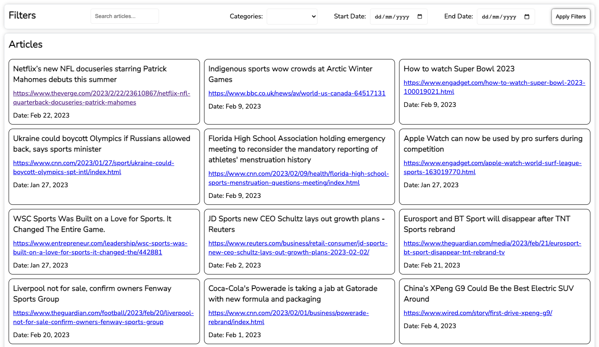

## News App

## Proposed Solution

- Fetch and display the latest football news articles from an API, such as News API.
- Allow users to search for news articles by keyword or topic.
- allow users to filter news articles

## Screenshots

## Libraries / Tools Used

- Angular
- Angular CLI for project setup

## Setup

To install the dependencies run:

`npm install`

And to run the app:

`npm start`

## Build

Run `ng build` to build the project. The build artifacts will be stored in the `dist/` directory.

### Environment Variables

1. Obtain an api key from [News API](https://newsapi.org/)
2. Add `apiKey` as property to the environment variable and pop in your api key.

## Running unit tests

Run `npm test` to execute the unit tests via [Karma](https://karma-runner.github.io).

## Future Work

1. Complete test coverage to achieve 90%
2. Improve styling and responsive design
3. Add Save Articles feature
